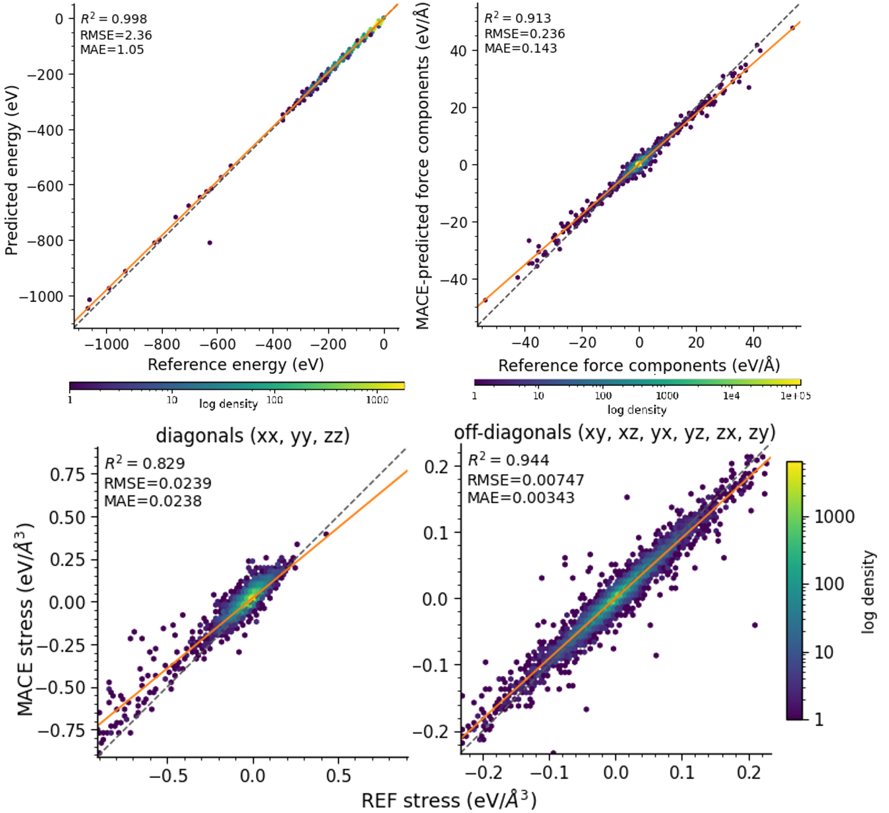
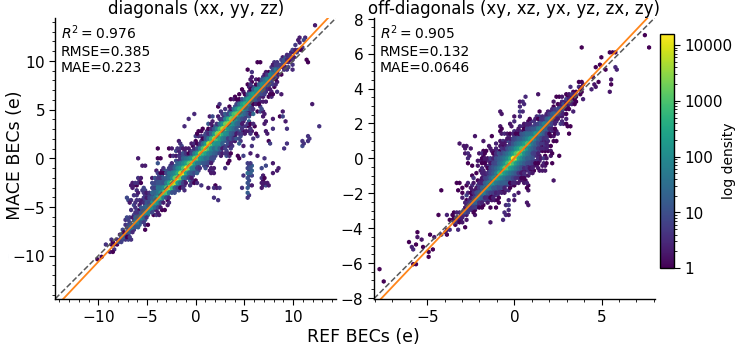
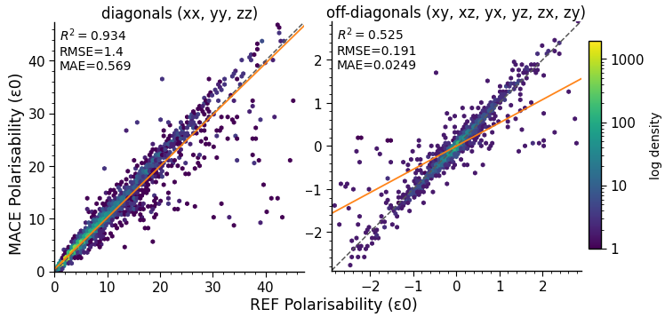
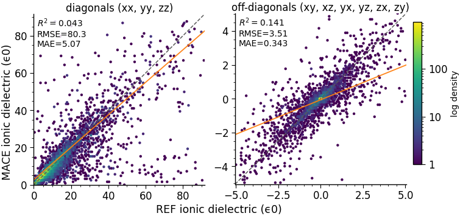
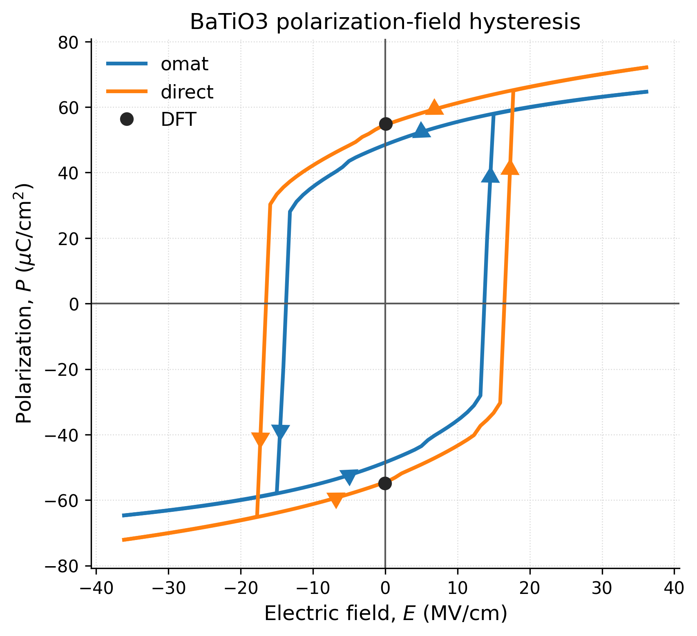
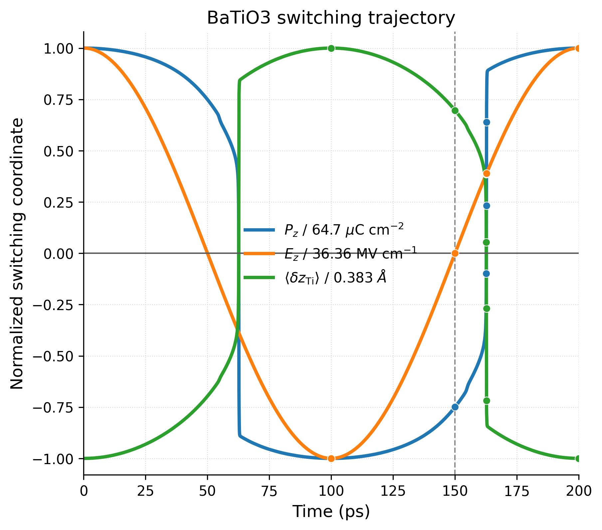
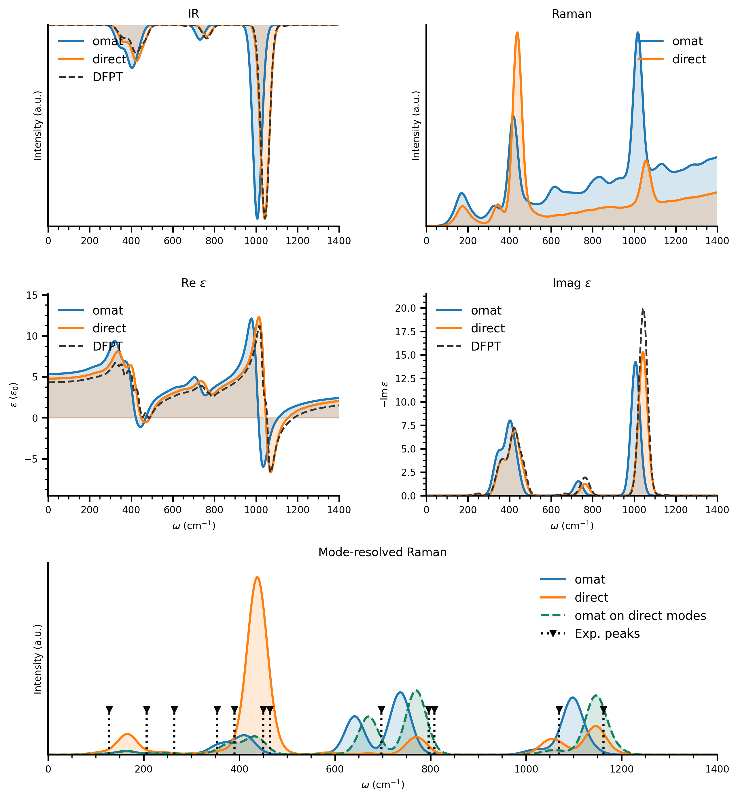

# MACE-Field: General Learning of the Electric Response of Inorganic Materials

This repository contains the manuscript source, analysis scripts, figure exports, compact summaries, and lightweight reproducibility scaffolding for the paper

> Bradley A. A. Martin, Alex M. Ganose, Venkat Kapil, Tingwei Li, and Keith T. Butler,  
> *General learning of the electric response of inorganic materials*

The companion codebase that implements the `MACEField` model itself lives in the separate [`mdi-group/mace-field`](https://github.com/mdi-group/mace-field) repository. This repository is the paper-specific reproducibility bundle built around that codebase.

## What is in this repository

- `mace-field.tex` and `mace-field-supplementary.tex`: current main manuscript and supplementary information.
- `figures/`: canonical figure copies used by the manuscript.
- `scripts/Foundation/`: OMAT-based multihead foundation-model fine-tuning, replay analysis, Hessian workflows, and dielectric post-processing.
- `scripts/Dielectrics/`: Materials Project dielectric dataset assembly, filtering, train/valid/test splitting, and Matbench overlap analysis.
- `scripts/Ferroelectrics/`: MP-Ferroelectric dataset assembly, direct ferroelectric training, and branch-aware polarisation analysis.
- `scripts/BaTiO3/`: direct single-material BaTiO3 training plus hysteresis analysis and snapshot plots.
- `scripts/SiO2/`: direct single-material alpha-quartz training plus spectroscopy, dielectric-relaxation, and mode-resolved Raman analysis.
- `scripts/LAMMPs/`: production MLMD launchers, trajectory post-processing, and model export helpers used for the BaTiO3 and SiO2 runs.

Each science subdirectory under `scripts/` now has its own README with folder-specific commands and key outputs:

- [Foundation](scripts/Foundation/README.md)
- [Dielectrics](scripts/Dielectrics/README.md)
- [Ferroelectrics](scripts/Ferroelectrics/README.md)
- [BaTiO3](scripts/BaTiO3/README.md)
- [SiO2](scripts/SiO2/README.md)
- [LAMMPs](scripts/LAMMPs/README.md)

## Release assets

The large artefacts for this paper are distributed through the matching GitHub release assets described in the [latest release](https://github.com/mdi-group/2025-04-mace-field/releases/tag/resubmitted). These archives contain the heavy files that are too large for the main repository, including full training logs, model checkpoints, processed dataset bundles, and saved MLMD trajectories.

Extract the assets into the matching workflow folders before rerunning the full paper analyses:

- `MACEField-omat-pbe-mh-0.zip` -> `scripts/Foundation/`
- `MACE-Field-MP-Dielectric.zip` -> `scripts/Dielectrics/`
- `MACE-Field-MP-Dielectrics.zip` -> `scripts/Dielectrics/`
- `MACE-Field-MP-Ferroelectrics.zip` -> `scripts/Ferroelectrics/`
- `MACE-Field-BaTiO3.zip` -> `scripts/BaTiO3/`
- `MACE-Field-SiO2.zip` -> `scripts/SiO2/`
- `MACE-Field-LAMMPs.zip` -> `scripts/LAMMPs/`

## Reproducibility assumptions

To reproduce the full paper outputs from the released artefacts, assume the following setup:

1. The matching release assets from [latest release](https://github.com/mdi-group/2025-04-mace-field/releases/tag/resubmitted) have been extracted into the corresponding `scripts/` subdirectories.
2. The `mace-field` code repository is checked out as a sibling code dependency, available at https://github.com/mdi-group/mace-field.
3. A Python environment with `torch`, `ase`, `matplotlib`, `pandas`, `numpy`, `pymatgen`, `mp-api`, `mpcontribs-client`, and the local `mace-field` package available.
4. For the MLMD workflows, `LAMMPS`, `Apptainer`, and the `macefield-lammps.sif` container used by the launch scripts. Available at https://github.com/orgs/mdi-group/packages.
5. A Materials Project API key in `MP_API_KEY` for regenerating the MP-Dielectric and MP-Ferroelectric datasets.

Some scripts still contain absolute paths reflecting the workstation layout above. The simplest route is to preserve that layout locally; otherwise, adjust the relevant path constants before rerunning heavy workflows.

## Quick start

- Read the manuscript in [mace-field.tex](mace-field.tex) and [mace-field-supplementary.tex](mace-field-supplementary.tex).
- Look at the final figure copies in [figures/](figures).
- Read [latest release](https://github.com/mdi-group/2025-04-mace-field/releases/tag/resubmitted) if you need the original large checkpoints, logs, splits, or trajectories.
- Use the subfolder READMEs in `scripts/` to trace each figure back to the exact training run, trajectory, and analysis command.

If you want to rebuild the main analysis outputs from the saved trajectories and checkpoints:

```bash
cd scripts/Foundation
python run_foundation_workflow.py --model-path MACEField-omat-dielectric.model --head pt_head --device cuda --gpus 0,1 --force
```

```bash
cd scripts/Ferroelectrics
python polarization_branches.py
```

```bash
cd scripts/BaTiO3
python plot_hysteresis.py \
  --curve OMAT ../LAMMPs/MD/runs/BaTiO3-mp-5986-sc1x1x1-0K-5GHz-hysteresis-2026-05-03_101740/BaTiO3-mp-5986/hysteresis.annotated.extxyz \
  --curve Direct ../LAMMPs/MD/runs/BaTiO3-mp-5986-sc1x1x1-0K-5GHz-hysteresis-2026-05-03_101759/BaTiO3-mp-5986/hysteresis.annotated.extxyz \
  --output-prefix plots/batio3_compare
```

```bash
cd scripts/SiO2
python mode_resolved_polarizability_derivatives.py --output-dir plots
python Spectroscopy.py \
  --curve OMAT ../LAMMPs/MD/runs/SiO2-mp-7000-sc1x1x1-300K-200ps-2026-05-03_101733/SiO2-mp-7000/production.annotated.extxyz \
  --curve Direct ../LAMMPs/MD/runs/SiO2-mp-7000-sc1x1x1-300K-200ps-2026-05-03_101749/SiO2-mp-7000/production.annotated.extxyz \
  --mode-resolved-dir plots \
  --output-prefix plots/sio2_compare \
  --save-plots --no-show
```

## End-to-end workflow

### 1. Regenerate cross-chemistry datasets

MP-Dielectric:

```bash
cd scripts/Dielectrics
python get-mp-dielectrics.py \
  --api-key "$MP_API_KEY" \
  --out MP-Dielectrics.extxyz \
  --write-filtered \
  --filtered-out MP-Dielectrics-filtered.extxyz \
  --write-splits \
  --split-prefix MP-Dielectrics-filtered \
  --verbose
```

MP-Ferroelectric:

```bash
cd ~/repositories/2025-04-mace-field/scripts/Ferroelectrics
python get_ferroelectric_dataset.py \
  --api-key "$MP_API_KEY" \
  --out MP-Ferroelectrics.xyz \
  --write-splits \
  --split-prefix MP-Ferroelectrics \
  --no-allow-branch-cross-split \
  --verbose
```

### 2. Train the direct and foundation models

```bash
cd scripts/Dielectrics && bash train-dielectric.sh
cd scripts/Ferroelectrics && bash train_ferroelectrics.sh
cd scripts/Foundation && bash train_foundation_mh.sh
cd scripts/BaTiO3 && bash train_BaTiO3.sh
cd scripts/SiO2 && bash train_SiO2.sh
```

### 3. Run the finite-field MLMD workflows

```bash
cd scripts/LAMMPs

# BaTiO3 hysteresis
MODEL_VARIANT=foundation ./run_batio3_hysteresis.sh
MODEL_VARIANT=finetuned  ./run_batio3_hysteresis.sh

# SiO2 production MLMD
MODEL_VARIANT=foundation ./run_sio2_mlmd.sh
MODEL_VARIANT=finetuned  ./run_sio2_mlmd.sh

# SiO2 finite-field dielectric relaxation
MODEL_VARIANT=foundation ./run_sio2_dielectric_relax.sh
MODEL_VARIANT=finetuned  ./run_sio2_dielectric_relax.sh
```

### 4. Rebuild the manuscript figures

The paper uses figure copies in `figures/`, but the source analyses live in the `scripts/` subdirectories. The table below shows the main mapping.

| Manuscript topic | Source workflow | Canonical figure copy |
| --- | --- | --- |
| Foundation replay / dielectric parity | [scripts/Foundation](scripts/Foundation/README.md) | `figures/omat-replay-parities.png`, `figures/omat-becs-parity.png`, `figures/omat-polarisability-parity.png`, `figures/omat-eps-inf-parity.png`, `figures/MACEField-eps_ionic_parity-omat.png` |
| Matbench dielectric check | [scripts/Dielectrics](scripts/Dielectrics/README.md) | `figures/MP-Dielectrics-filtered-matbench-refractive-index-parity.png` |
| Ferroelectric parity / spontaneous polarisation | [scripts/Ferroelectrics](scripts/Ferroelectrics/README.md) | `figures/MACE-Field-MP-Ferroelectrics_parity_folded_splits.png`, `figures/MACEField-omat-dielectric_parity_folded_splits.png`, `figures/MACE-Field-MP-Ferroelectrics_spontaneous_polarization_folded_splits.png`, `figures/MACEField-omat-dielectric_spontaneous_polarization_folded_splits.png` |
| BaTiO3 hysteresis and snapshots | [scripts/BaTiO3](scripts/BaTiO3/README.md) | `figures/batio3_compare.png`, `figures/batio3_switching_trace.png`, `figures/batio3_hysteresis_snapshots.png` |
| SiO2 spectra and dielectric relaxation | [scripts/SiO2](scripts/SiO2/README.md) | `figures/sio2_compare.png`, `figures/sio2_thermo_trace.png`, `figures/sio2_representative_snapshots.png` |


## Key figures

### OMAT-based field-aware foundation model: `MACE-Field-MH-0`

<p align="center">
  
  
  
  
</p>

### BaTiO3 finite-field hysteresis

<p align="center">
  
  
</p>

### Alpha-quartz spectroscopy and mode-resolved Raman analysis



## Data and model artefacts

This repository includes the manuscript source, plotting scripts, figure copies, and compact CSV/JSON summaries used to document the final analyses.

The heavier artefacts used by the paper, including full training logs, large model checkpoints, processed dataset bundles, and saved MLMD trajectories, are distributed via the release assets documented in [latest release](https://github.com/mdi-group/2025-04-mace-field/releases/tag/resubmitted). Extract those archives into the matching `scripts/` subdirectories before rerunning the full paper workflows.

## Citation

If you use this repository or the accompanying `MACEField` model in your own work, please cite the paper and the code repository.

```bibtex
@misc{martin2025generallearningelectricresponse,
  title={General Learning of the Electric Response of Inorganic Materials},
  author={Martin, Bradley A. A. and Ganose, Alex M. and Kapil, Venkat and Li, Tingwei and Butler, Keith T.},
  year={2025},
  eprint={2508.17870},
  archivePrefix={arXiv},
}
```

# Acknowledgments
This work has been supported by UKRI funding (EP/Y000552/1 and EP/Y014405/1).

---

## Contact

- **MACE-Field**: bradley.martin@ucl.ac.uk  
- Issues & feature requests: https://github.com/mdi-group/mace-field/issues
