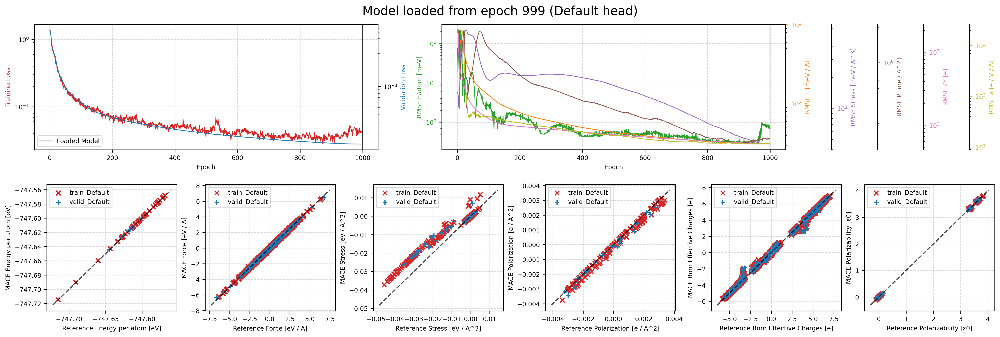
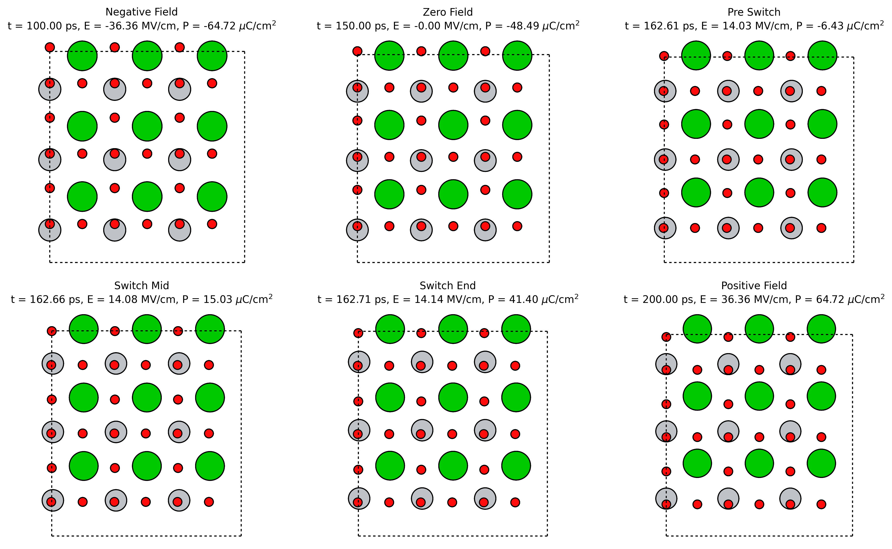

# BaTiO3 direct-model workflow

This folder contains the single-material BaTiO3 direct model, the training artefacts for that model, and the post-processing used to compare the direct hysteresis loop against the OMAT-based foundation loop.

Heavy artefacts for this workflow are distributed in the release assets `MACE-Field-BaTiO3.zip` and `LAMMPs.zip`; see [../../GITHUB_RELEASE.md](../../GITHUB_RELEASE.md). Extract them into `scripts/BaTiO3/` and `scripts/LAMMPs/` for the original direct checkpoint, training logs, and saved hysteresis trajectories.

Important files:

- `BaTiO3-preprocessed.xyz`: direct-training dataset.
- `MACE-Field-BaTiO3.model`: direct BaTiO3 specialist model.
- `plots/batio3_compare.png`: overlaid direct / OMAT / DFT comparison used in the paper.
- `plots/batio3_switching_trace.png`: trajectory diagnostic used alongside the hysteresis loop.
- `plots/batio3_hysteresis_snapshots.png`: representative switching snapshots.

## Key plots

### Training curve

<p align="center">
  
</p>

### Hysteresis and trajectory diagnostics

<p align="center">
  
  
</p>

<p align="center">
  
</p>

## Main entry points

Run all commands from this directory unless noted otherwise:

```bash
cd scripts/BaTiO3
```

### 1. Train the direct BaTiO3 specialist

```bash
bash train_BaTiO3.sh
```

Outputs:

- `results/MACE-Field-BaTiO3_run-23_train.txt`
- `logs/MACE-Field-BaTiO3_run-23.log`
- `checkpoints/`

### 2. Run the BaTiO3 hysteresis MD jobs

These launchers live in `../LAMMPs/`. The committed paper runs are:

- OMAT foundation run: `../LAMMPs/MD/runs/BaTiO3-mp-5986-sc1x1x1-0K-5GHz-hysteresis-2026-05-03_101740/...`
- Direct specialist run: `../LAMMPs/MD/runs/BaTiO3-mp-5986-sc1x1x1-0K-5GHz-hysteresis-2026-05-03_101759/...`

To rerun them:

```bash
cd ../LAMMPs
MODEL_VARIANT=foundation ./run_batio3_hysteresis.sh
MODEL_VARIANT=finetuned  ./run_batio3_hysteresis.sh
```

### 3. Rebuild the overlaid hysteresis comparison

```bash
cd ../BaTiO3
python plot_hysteresis.py \
  --curve OMAT ../LAMMPs/MD/runs/BaTiO3-mp-5986-sc1x1x1-0K-5GHz-hysteresis-2026-05-03_101740/BaTiO3-mp-5986/hysteresis.annotated.extxyz \
  --curve Direct ../LAMMPs/MD/runs/BaTiO3-mp-5986-sc1x1x1-0K-5GHz-hysteresis-2026-05-03_101759/BaTiO3-mp-5986/hysteresis.annotated.extxyz \
  --output-prefix plots/batio3_compare
```

This writes:

- `plots/batio3_compare.png`
- `plots/batio3_compare.pdf`
- `plots/batio3_compare_metrics.csv`

### 4. Rebuild the switching snapshots and trajectory diagnostics

```bash
python make_hysteresis_snapshots.py \
  --input ../LAMMPs/MD/runs/BaTiO3-mp-5986-sc1x1x1-0K-5GHz-hysteresis-2026-05-03_101759/BaTiO3-mp-5986/hysteresis.annotated.extxyz \
  --output-dir plots
```

This writes:

- `plots/batio3_hysteresis_snapshots.png`
- `plots/batio3_switching_trace.png`
- `plots/batio3_snapshot_summary.csv`

## Notes

- The direct specialist is the `Default`-head BaTiO3 model committed in this folder.
- In a lightweight checkout, the large direct-model artefacts and saved MD trajectories are expected to come from the release assets above.
- The hysteresis comparison plot is built from the annotated `extxyz` trajectories produced by the `LAMMPs` workflows, not from the training set directly.
- The manuscript copies of the BaTiO3 figures are stored in `../../figures/`.
