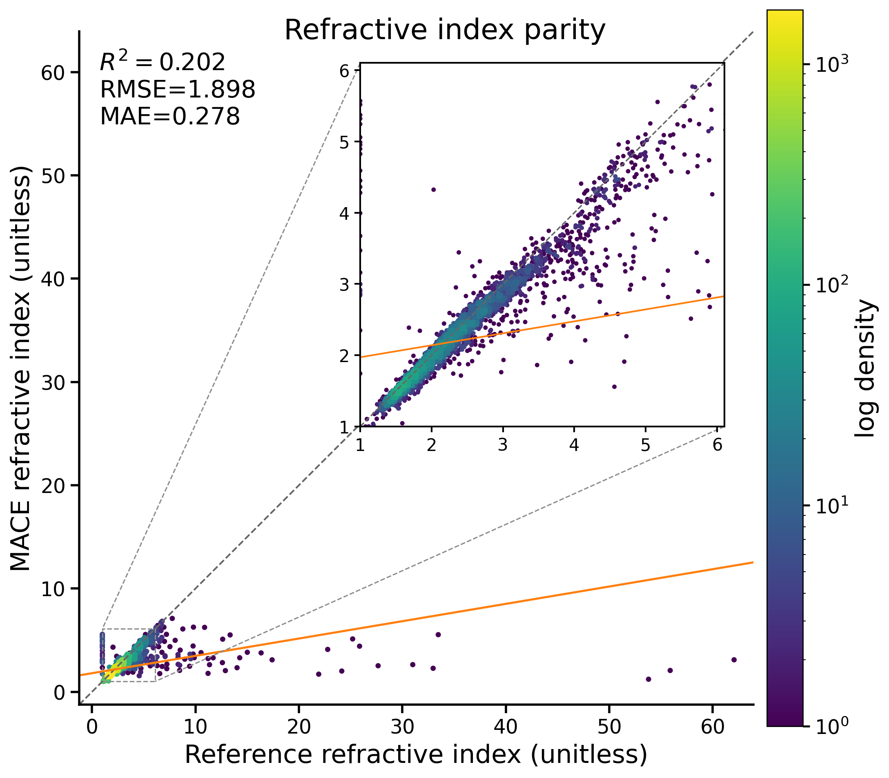

# MP-Dielectric workflow

This folder contains the Materials Project dielectric dataset assembly, filtering, splitting, direct dielectric-model training, and Matbench overlap / refractive-index analysis.

Important data files:

- `MP-Dielectrics.extxyz`: raw assembled dataset.
- `MP-Dielectrics-filtered.extxyz`: filtered dataset used in the final paper workflow.
- `MP-Dielectrics-filtered-{train,valid,test}.xyz`: committed splits used by the training and foundation workflows.

## Key plots

### Training curve

<p align="center">
  
</p>

### Matbench overlap and refractive-index check

<p align="center">
  
</p>

The heavier BEC / polarizability parity plots used by the manuscript are generated through the foundation workflow in [../Foundation/README.md](../Foundation/README.md).

## Main entry points

Run all commands from this directory:

```bash
cd scripts/Dielectrics
```

### 1. Regenerate the MP-Dielectric dataset from the Materials Project API

```bash
python get-mp-dielectrics.py \
  --api-key "$MP_API_KEY" \
  --out MP-Dielectrics.extxyz \
  --write-filtered \
  --filtered-out MP-Dielectrics-filtered.extxyz \
  --write-splits \
  --split-prefix MP-Dielectrics-filtered \
  --verbose
```

This script can:

- fetch the raw dielectric dataset,
- filter high-force / pathological-BEC / pathological-dielectric entries,
- optionally deduplicate,
- write train/valid/test splits in `extxyz` format.

### 2. Train the direct dielectric model

```bash
bash train-dielectric.sh
```

Outputs:

- `results/MACE-Field-MP-Dielectrics_run-23_train.txt`
- `logs/MACE-Field-MP-Dielectrics_run-23.log`
- `checkpoints/`

### 3. Check overlap with Matbench dielectric and run refractive-index prediction

```bash
python check-matbench-dielectric-overlap.py \
  --mp-dataset MP-Dielectrics-filtered.extxyz \
  --predict-refractive-index \
  --model-path ../Foundation/MACEField-omat-dielectric.model \
  --head pt_head \
  --device cuda
```

Outputs:

- `MP-Dielectrics-filtered-vs-matbench-dielectric-overlap.csv`
- `MP-Dielectrics-filtered-vs-matbench-dielectric-overlap.json`
- `MP-Dielectrics-filtered-matbench-refractive-index-predictions.csv`
- `MP-Dielectrics-filtered-matbench-refractive-index-summary.json`
- `MP-Dielectrics-filtered-matbench-refractive-index-parity.png`

## Notes

- The final manuscript uses the filtered dataset and filtered splits committed here.
- The foundation-model paper figures use these splits through the scripts in `../Foundation/`.
- The raw `matbench_dielectric.json.gz` cache is kept here so the overlap analysis can be rerun offline once downloaded.
