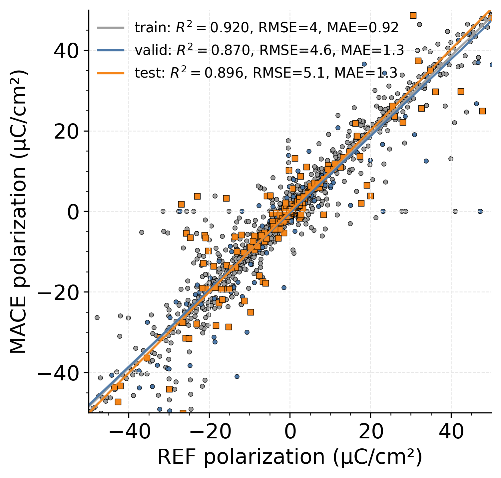
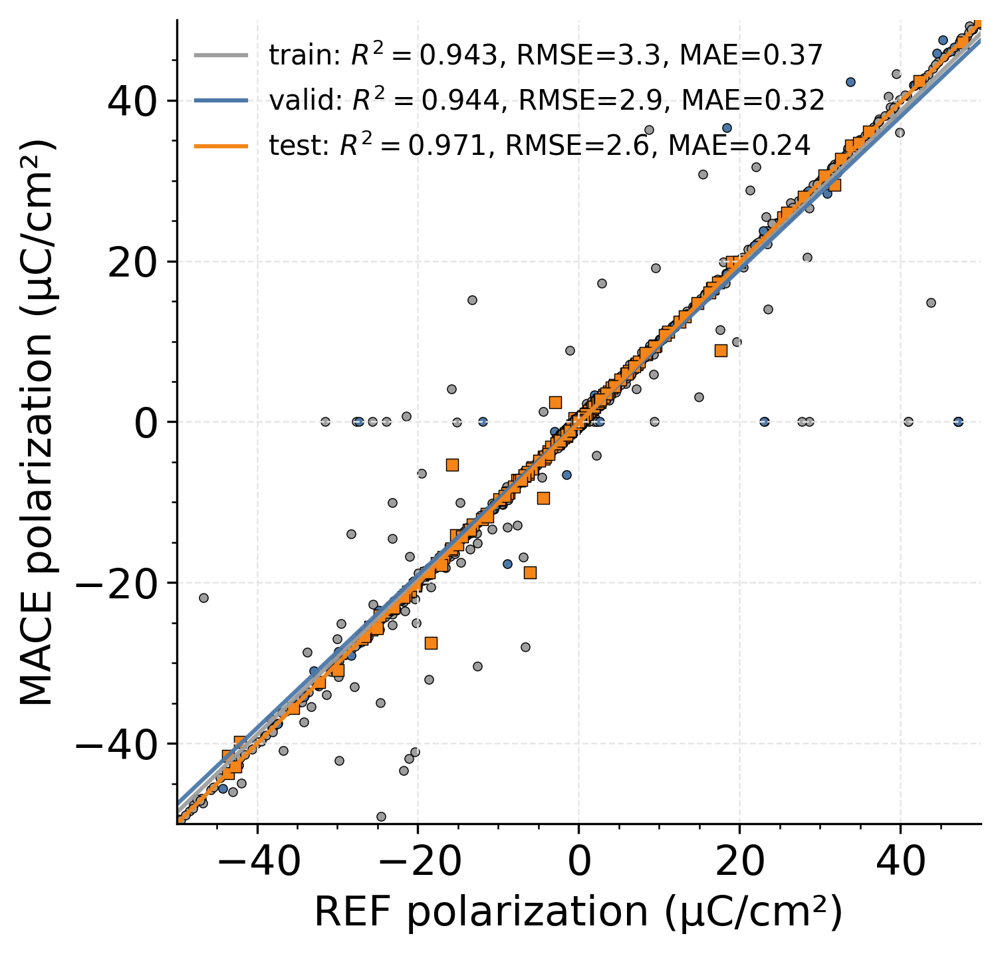
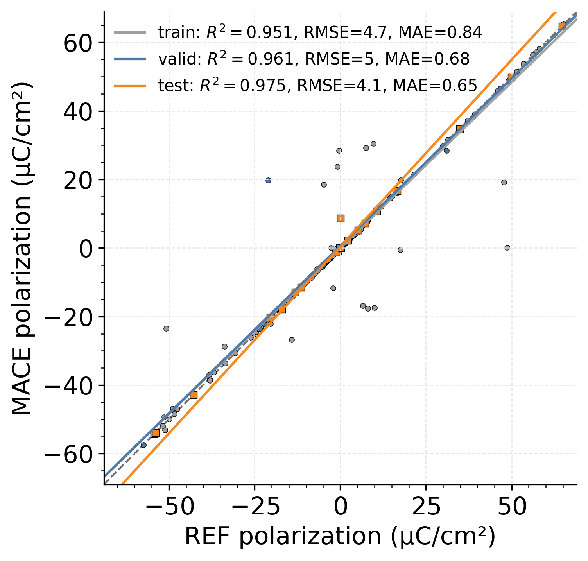

# MP-Ferroelectric workflow

This folder contains the cross-chemistry ferroelectric dataset assembly, direct ferroelectric-model training, and branch-aware polarisation analysis used for the folded parity and spontaneous-polarisation results.

Important data and model files:

- `MP-Ferroelectrics.xyz`: combined ferroelectric dataset.
- `MP-Ferroelectrics-{train,valid,test}.xyz`: committed splits used in the paper.
- `MACE-Field-MP-Ferroelectrics.model`: direct ferroelectric model.
- `MACEField-omat-dielectric.model`: OMAT-based foundation checkpoint used for comparison.

## Key plots

Direct ferroelectric model:



OMAT-based foundation comparison:



Spontaneous polarisation:



## Main entry points

Run all commands from this directory:

```bash
cd scripts/Ferroelectrics
```

### 1. Regenerate the MP-Ferroelectric dataset from MPContribs / Materials Project

```bash
python get_ferroelectric_dataset.py \
  --api-key "$MP_API_KEY" \
  --out MP-Ferroelectrics.xyz \
  --write-splits \
  --split-prefix MP-Ferroelectrics \
  --no-allow-branch-cross-split \
  --verbose
```

The committed splits were created with branch-aware grouping so that branch/path leakage is avoided.

### 2. Train the direct ferroelectric model

```bash
bash train_ferroelectrics.sh
```

Outputs:

- `results/MACE-Field-MP-Ferroelectrics_run-23_train.txt`
- `logs/MACE-Field-MP-Ferroelectrics_run-23.log`
- `checkpoints/`

### 3. Run the folded-branch analysis

With the defaults, the analysis script evaluates both the direct ferroelectric model and the OMAT-based foundation model committed in this folder.

```bash
python polarization_branches.py
```

Key outputs:

- `analysis_outputs/polarization_branches/*_parity_folded_splits.png`
- `analysis_outputs/polarization_branches/*_spontaneous_polarization_folded_splits.png`
- `analysis_outputs/polarization_branches/*_fractional_branch_distribution.png`
- `analysis_outputs/polarization_branches/combined_polarization_summary.csv`

## Notes

- The folding / branch matching here is the paper workflow used for the ferroelectric parity figures.
- The final manuscript copies of the main folded parity plots live in `../../figures/`.
- The foundation comparison in this folder uses the OMAT-based multihead checkpoint rather than the older MP-traj-era model.
