# Foundation workflow

This folder contains the OMAT-based multihead `MACEField` foundation-model workflow used for the cross-chemistry dielectric and ferroelectric results in the paper.

Heavy artefacts for this workflow are distributed in the release asset `MACEField-omat-pbe-mh-0.zip`; see the [latest release](https://github.com/mdi-group/2025-04-mace-field/releases/tag/resubmitted). Extract that archive into `scripts/Foundation/` if you want the original checkpoint, full logs, and replay subset used in the paper.

The main local checkpoint is:

- `MACEField-omat-dielectric.model`

The committed training and analysis outputs include:

- `results/`: head-resolved loss curves from training.
- `analysis_outputs/foundation_workflow/parity/`: replay, dielectric, and ferroelectric parity outputs.
- `analysis_outputs/foundation_workflow/hessian/`: Hessian and ionic-dielectric analysis outputs.
- `data/`: combined dielectric/ferroelectric training file plus OMAT-PBE replay subsets.

## Key plots

### Training curves

<p align="center">
  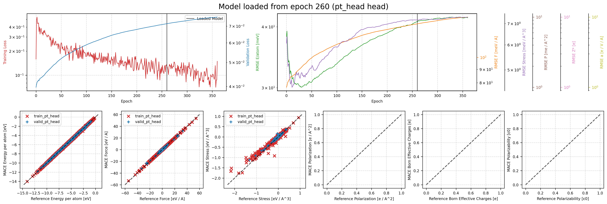
  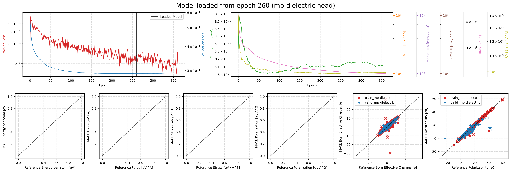
  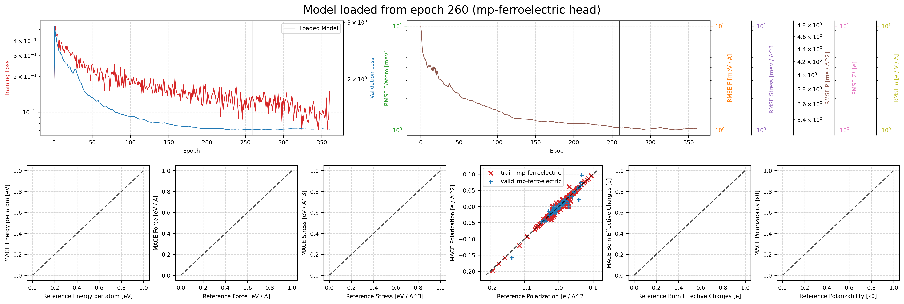
</p>

### Replay and response parity

<p align="center">
  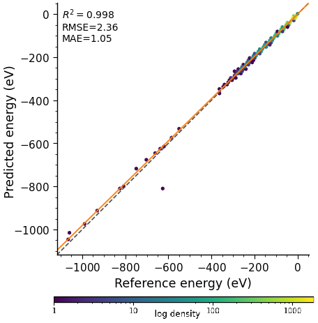
  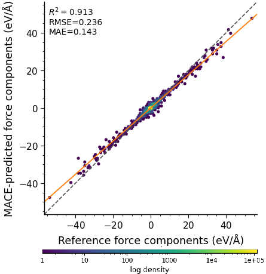
  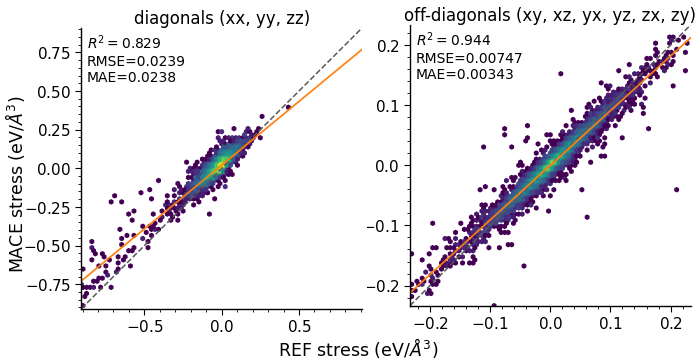
</p>

<p align="center">
  
  
</p>

<p align="center">
  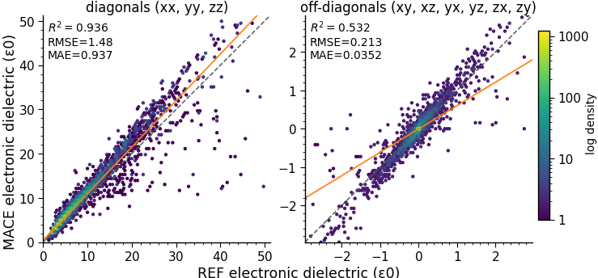
  
</p>

### Density plots

<p align="center">
  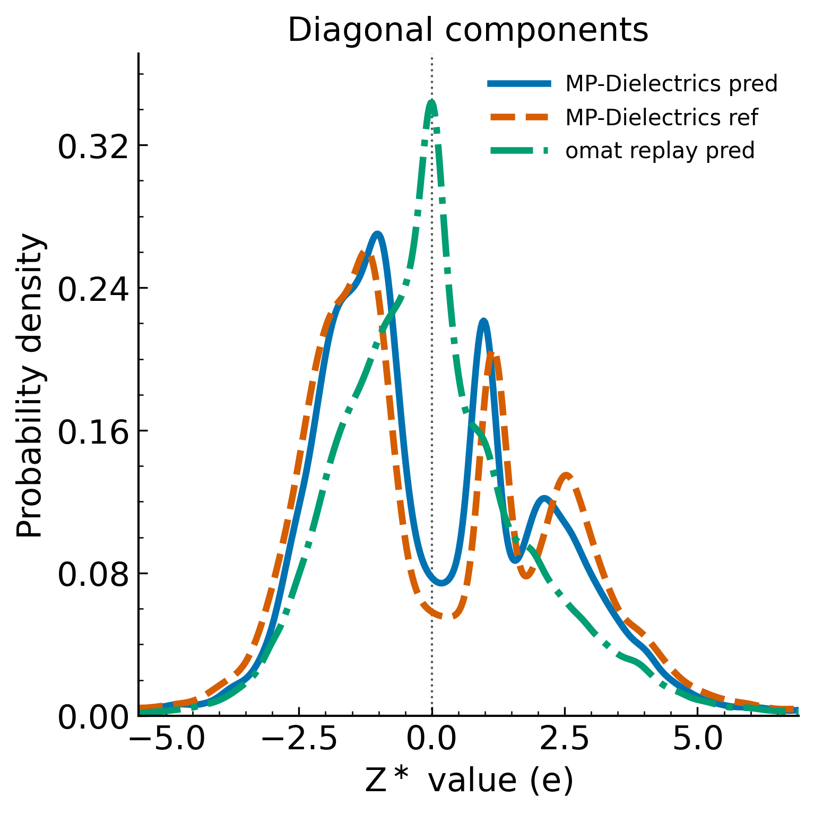
  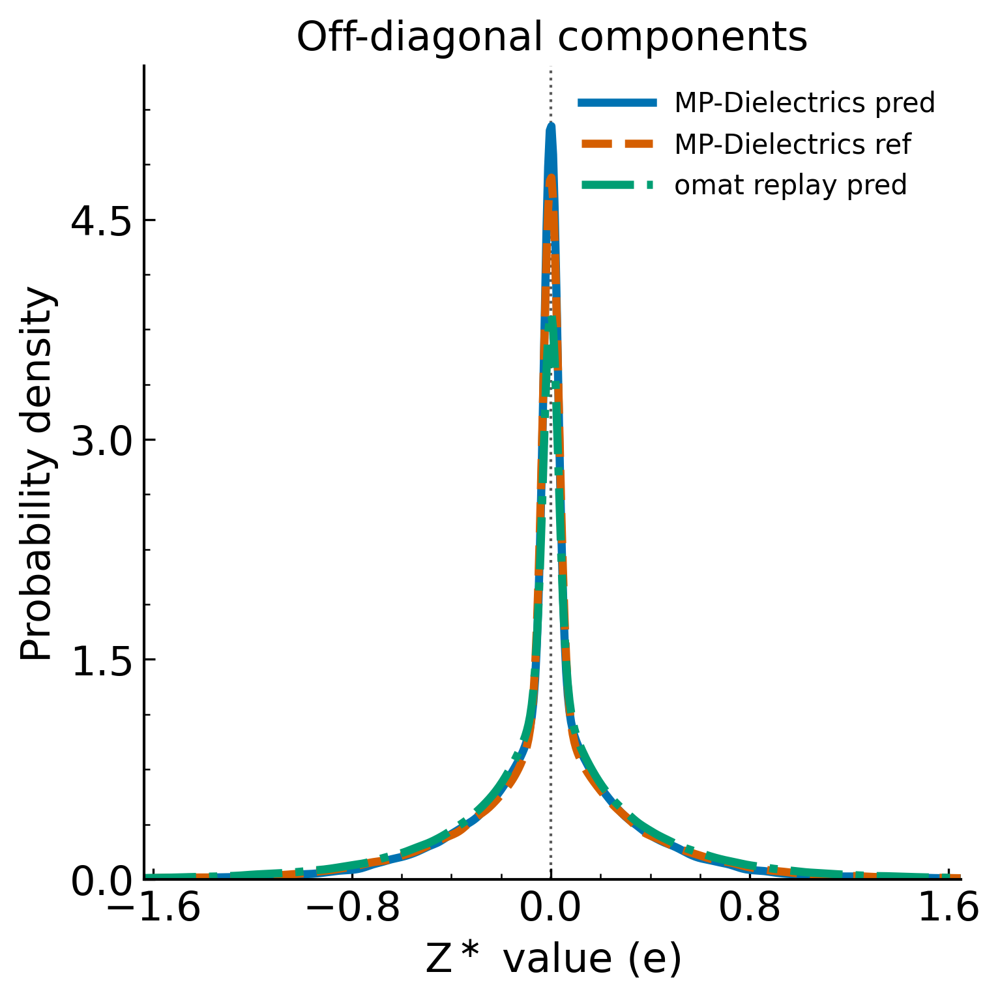
</p>

<p align="center">
  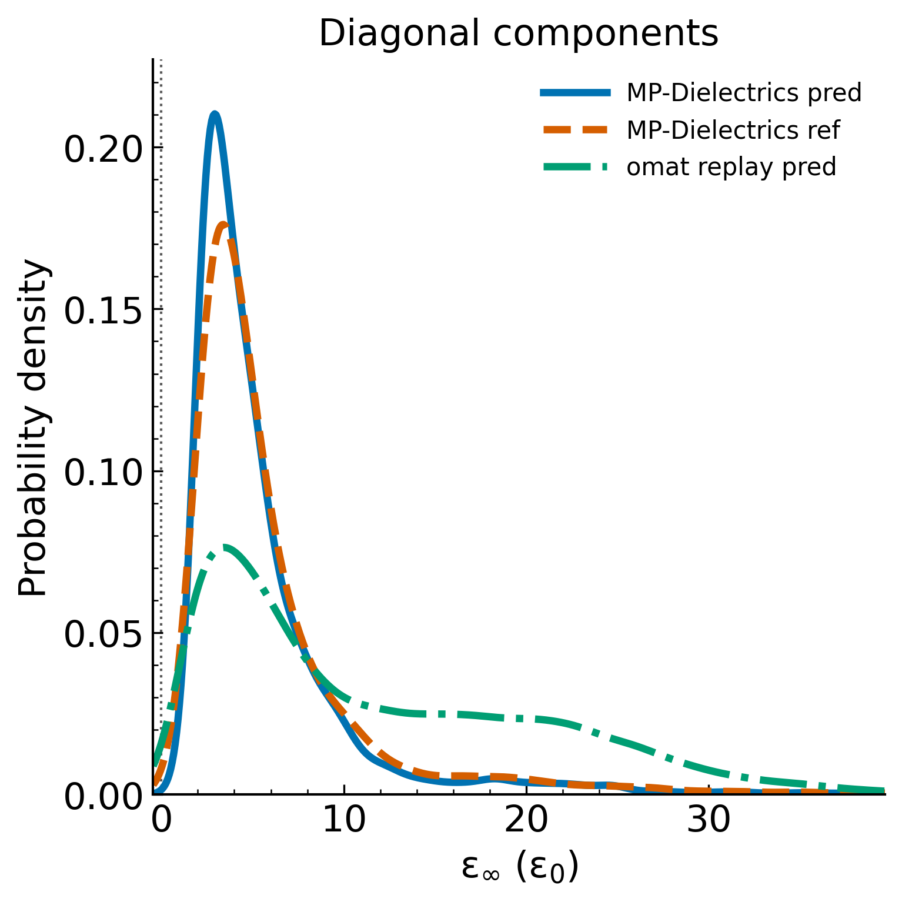
  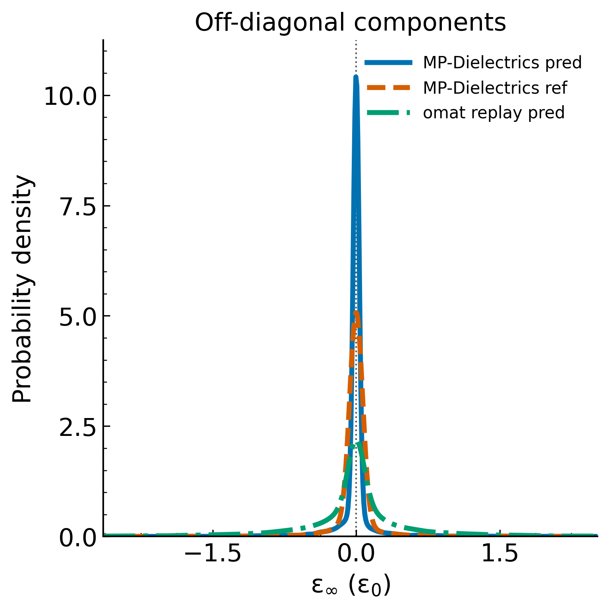
</p>

## Main entry points

Run all commands from this directory:

```bash
cd scripts/Foundation
```

### 1. Fine-tune the OMAT-based foundation model

`train_foundation_mh.sh` contains the paper training command. The commented block at the top optionally regenerates the replay subset used for pseudolabel replay.

```bash
bash train_foundation_mh.sh
```

Important local artefacts:

- `train_foundation_mh.sh`: multihead fine-tuning recipe.
- `mace-mh-0.model`: starting multihead MACE foundation.
- `data/replay-data-mh-1-omat-pbe.xyz`: OMAT-PBE replay source.
- `data/subselected-replay-data-mh-0-omat-pbe.xyz`: replay subset used in training.

### 2. Run the full parity + Hessian workflow

This is the main “paper results” driver for the foundation model.

```bash
python run_foundation_workflow.py \
  --model-path MACEField-omat-dielectric.model \
  --head pt_head \
  --device cuda \
  --gpus 0,1 \
  --force
```

This writes:

- replay energy / force / stress parity,
- dielectric and ferroelectric parity predictions,
- filtered and unfiltered Hessian diagnostics,
- ionic dielectric parity plots,
- summary tables in `analysis_outputs/foundation_workflow/parity/tables/`.

### 3. Run the parity stage only

```bash
python plot_foundation.py \
  --model-path MACEField-omat-dielectric.model \
  --head pt_head \
  --device cuda \
  --output-dir analysis_outputs/foundation_workflow/parity \
  --force
```

### 4. Recompute Hessians / ionic dielectric constants

```bash
python ht_hessian_mace_mp_d3.py \
  ../Dielectrics/MP-Dielectrics-filtered-valid.xyz \
  analysis_outputs/foundation_workflow/hessian/dielectric_hessians.xyz \
  analysis_outputs/foundation_workflow/hessian/dielectric_hessians.h5 \
  --model MACEField-omat-dielectric.model \
  --head pt_head \
  --device cuda

python ionic_dielectric_from_hessians.py \
  analysis_outputs/foundation_workflow/hessian/dielectric_hessians.xyz \
  analysis_outputs/foundation_workflow/hessian/dielectric_hessians.h5
```

In practice, `run_foundation_workflow.py` is the preferred wrapper because it also manages plot generation and filtering summaries.

## Notes

- The local model is the OMAT-based field-aware foundation used in the final manuscript.
- In a lightweight clone of the repository, the large checkpoint and training-log files are expected to come from the release asset rather than Git history.
- Several scripts refer to the replay/foundation inference head as `pt_head`; this is the head name expected by the local analysis scripts.
- Final manuscript figure copies are stored in `../../figures/`, but the source outputs live in this folder.
