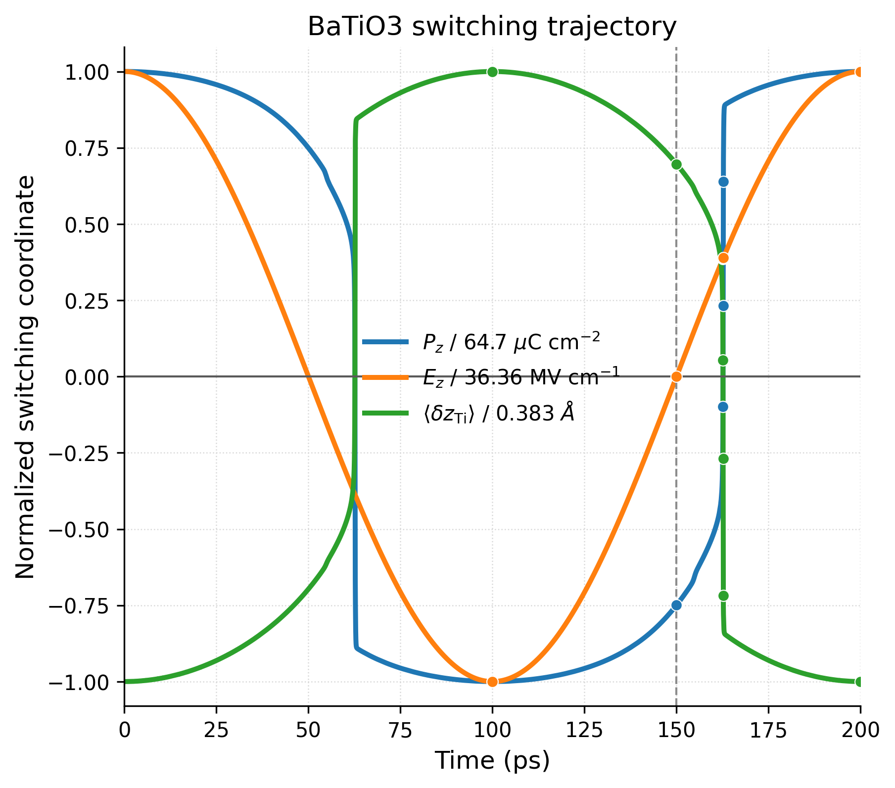
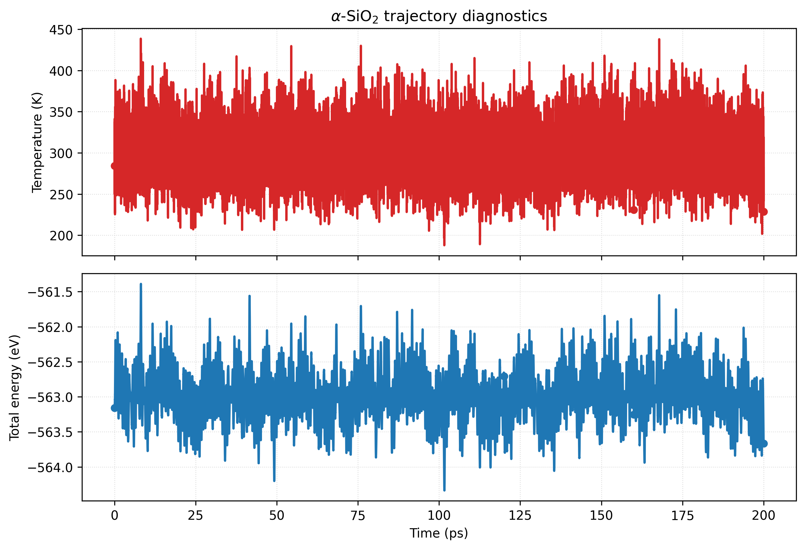

# LAMMPS / MLMD workflow

This folder contains the production finite-field molecular-dynamics launchers, ML-IAP model-export helpers, live/post hoc response logging tools, and saved run directories used for the BaTiO3 and SiO2 case studies in the paper.

The main launchers are:

- `run_batio3_hysteresis.sh`
- `run_sio2_mlmd.sh`
- `run_sio2_dielectric_relax.sh`

Auxiliary utilities:

- `postprocess_macefield_xyz.py`
- `lammps_dump_to_extxyz.py`
- `live_macefield_logger.py`
- `view_lammps_trajectory.ipynb`

## Key downstream figures generated from these runs

This folder consumes trained checkpoints from the sibling model directories and does not contain its own `results/` training-curve outputs. The main visual artefacts here are the saved MD trajectories and the downstream comparison plots rebuilt from them.

<p align="center">
  
  
</p>

<p align="center">
  
  
</p>

## Main entry points

Run all commands from this directory:

```bash
cd scripts/LAMMPs
```

### 1. BaTiO3 hysteresis workflow

Foundation and direct specialist runs:

```bash
MODEL_VARIANT=foundation ./run_batio3_hysteresis.sh
MODEL_VARIANT=finetuned  ./run_batio3_hysteresis.sh
```

Committed paper runs:

- foundation / OMAT: `MD/runs/BaTiO3-mp-5986-sc1x1x1-0K-5GHz-hysteresis-2026-05-03_101740/`
- direct specialist: `MD/runs/BaTiO3-mp-5986-sc1x1x1-0K-5GHz-hysteresis-2026-05-03_101759/`

Key outputs per run:

- `hysteresis.lammpstrj`
- `hysteresis.raw.extxyz`
- `hysteresis.annotated.extxyz`
- `hysteresis_thermo.tsv`

### 2. SiO2 production MLMD

```bash
MODEL_VARIANT=foundation ./run_sio2_mlmd.sh
MODEL_VARIANT=finetuned  ./run_sio2_mlmd.sh
```

Committed paper runs:

- foundation / OMAT: `MD/runs/SiO2-mp-7000-sc1x1x1-300K-200ps-2026-05-03_101733/`
- direct specialist: `MD/runs/SiO2-mp-7000-sc1x1x1-300K-200ps-2026-05-03_101749/`

Key outputs per run:

- `production.lammpstrj`
- `production.raw.extxyz`
- `production.annotated.extxyz`
- `production_thermo.tsv`

### 3. SiO2 finite-field dielectric relaxation

```bash
MODEL_VARIANT=foundation ./run_sio2_dielectric_relax.sh
MODEL_VARIANT=finetuned  ./run_sio2_dielectric_relax.sh
```

Committed paper runs:

- foundation / OMAT: `MD/runs/SiO2-mp-7000-sc1x1x1-dielectric-relax-2026-05-04_153401/`
- direct specialist: `MD/runs/SiO2-mp-7000-sc1x1x1-dielectric-relax-2026-05-04_153404/`

Key outputs per run:

- `relaxed_zero.annotated.extxyz`
- `relaxed_field_{x,y,z}.annotated.extxyz`
- `dielectric_relax_summary.csv`
- `dielectric_relax_summary.json`

### 4. Inspect trajectories interactively

```bash
jupyter notebook view_lammps_trajectory.ipynb
```

The notebook supports LAMMPS trajectory browsing and was added specifically to inspect the saved MLMD runs in this folder.

## Notes

- These shell workflows handle both the LAMMPS stage and the response backfilling / annotation stage needed for `P`, `Z*`, and polarizability because current `LAMMPS` `ML-IAP` usage only evaluates energies and forces during the MD loop itself.
- The scripts assume the `macefield-lammps.sif` container and the author’s `MACEField` conda environment are available.
- The `models/` folder contains both the plain `.model` checkpoints and the exported `-mliap_lammps.pt` artefacts used by LAMMPS.
