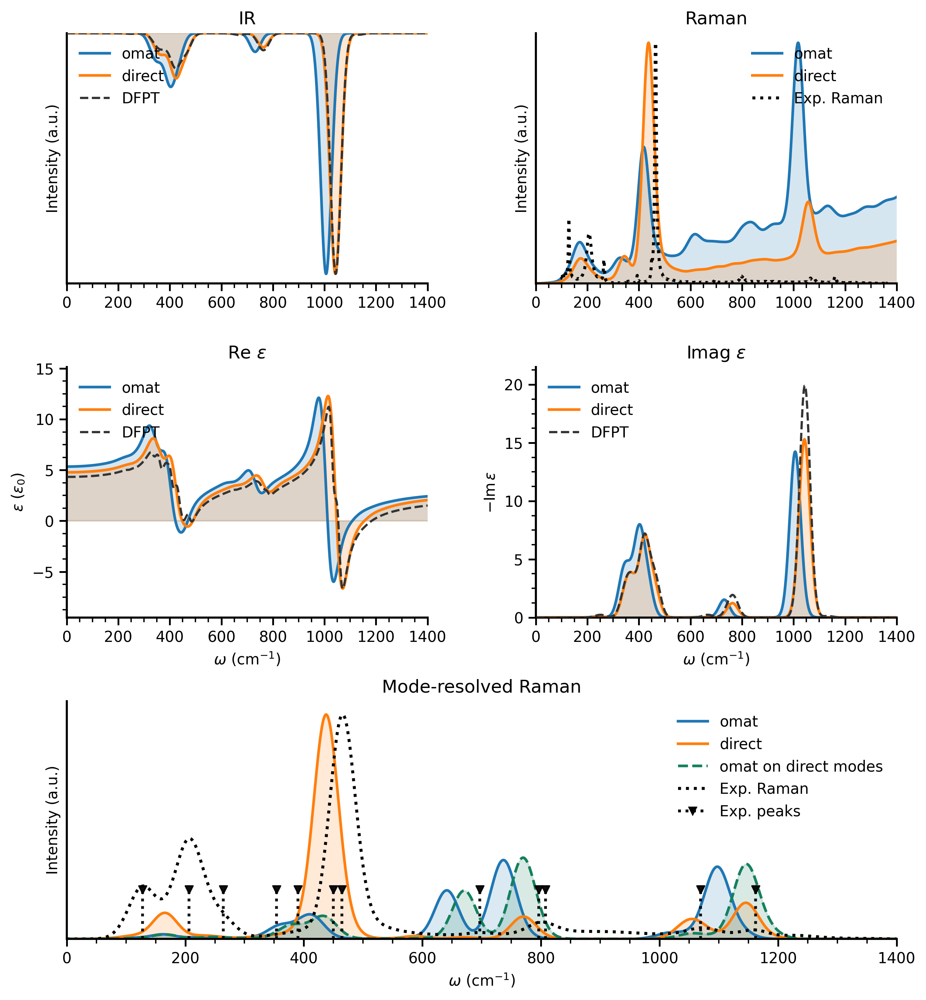
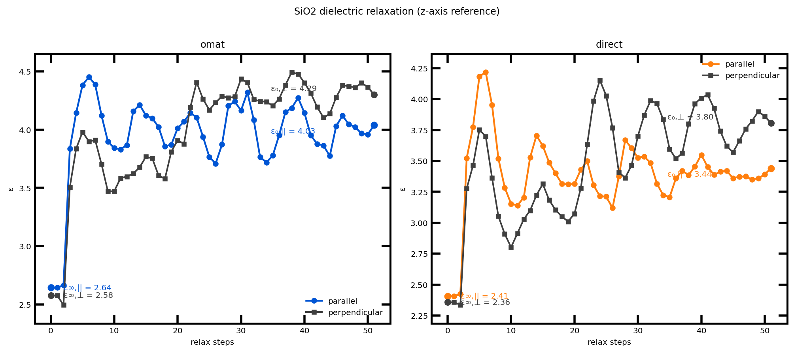
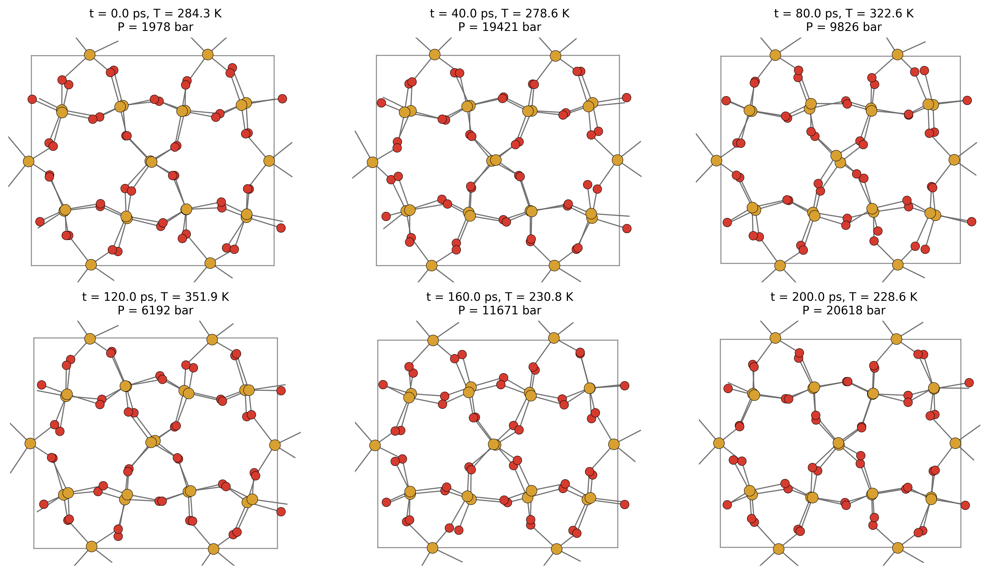

# alpha-quartz workflow

This folder contains the single-material alpha-quartz direct model, spectroscopy analysis, dielectric-relaxation analysis, and the mode-resolved Raman diagnostics used to interpret the foundation-model limitations.

Important files:

- `SiO2-preprocessed.xyz`: direct-training dataset.
- `MACE-field-SiO2.model`: direct quartz specialist model.
- `plots/sio2_compare.png`: main spectroscopy comparison figure used in the paper.
- `plots/sio2_dielectric_relax_compare_relaxation.png`: finite-field dielectric-relaxation comparison.
- `plots/sio2_representative_snapshots.png` and `plots/sio2_thermo_trace.png`: trajectory snapshot / diagnostics figures.

## Key plots







## Main entry points

Run all commands from this directory unless noted otherwise:

```bash
cd scripts/SiO2
```

### 1. Train the direct alpha-quartz specialist

```bash
bash train_SiO2.sh
```

Outputs:

- `results/MACE-field-SiO2_run-23_train.txt`
- `logs/MACE-field-SiO2_run-23.log`
- `checkpoints/`

### 2. Run the MLMD and dielectric-relaxation jobs

The committed paper runs are:

- OMAT production MLMD: `../LAMMPs/MD/runs/SiO2-mp-7000-sc1x1x1-300K-200ps-2026-05-03_101733/...`
- Direct production MLMD: `../LAMMPs/MD/runs/SiO2-mp-7000-sc1x1x1-300K-200ps-2026-05-03_101749/...`

To rerun them:

```bash
cd ../LAMMPs
MODEL_VARIANT=foundation RUN_IN_BACKGROUND=0 ./run_sio2_mlmd.sh
MODEL_VARIANT=finetuned  RUN_IN_BACKGROUND=0 ./run_sio2_mlmd.sh
```

### 3. Rebuild the mode-resolved Raman analysis

```bash
cd ../SiO2
python mode_resolved_polarizability_derivatives.py --output-dir plots
```

This writes the mode-resolved CSV summaries used to diagnose the Raman discrepancy between the direct and foundation models.

### 4. Rebuild the main spectroscopy comparison figure

```bash
python Spectroscopy.py \
  --curve OMAT ../LAMMPs/MD/runs/SiO2-mp-7000-sc1x1x1-300K-200ps-2026-05-03_101733/SiO2-mp-7000/production.annotated.extxyz \
  --curve Direct ../LAMMPs/MD/runs/SiO2-mp-7000-sc1x1x1-300K-200ps-2026-05-03_101749/SiO2-mp-7000/production.annotated.extxyz \
  --mode-resolved-dir plots \
  --output-prefix plots/sio2_compare \
  --save-plots --no-show
```

Key outputs:

- `plots/sio2_compare.png`
- `plots/sio2_compare_summary.csv`
- `plots/sio2_compare_{direct,omat}_summary.json`
- `plots/sio2_compare_{direct,omat}_correlation.csv`


### 5. Rebuild the trajectory snapshots and thermo trace

```bash
python make_spectroscopy_snapshots.py \
  --input ../LAMMPs/MD/runs/SiO2-mp-7000-sc1x1x1-300K-200ps-2026-05-03_101749/SiO2-mp-7000/production.annotated.extxyz \
  --output-dir plots
```

This writes:

- `plots/sio2_representative_snapshots.png`
- `plots/sio2_thermo_trace.png`
- `plots/sio2_snapshot_summary.csv`

## Notes

- The direct quartz model uses the `Default` head; the foundation comparison uses the OMAT-based multihead checkpoint.
- The mode-resolved Raman workflow is the main diagnostic behind the paper’s discussion of the remaining foundation-model Raman limitation.
- Final manuscript figure copies are stored in `../../figures/`.
